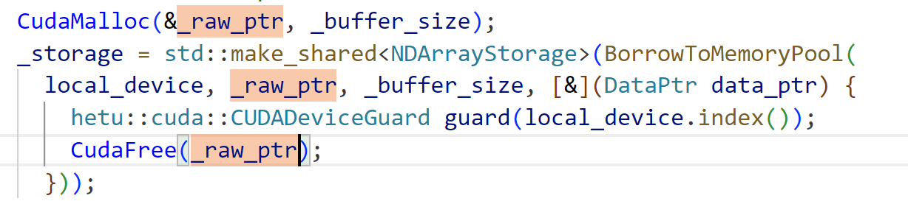
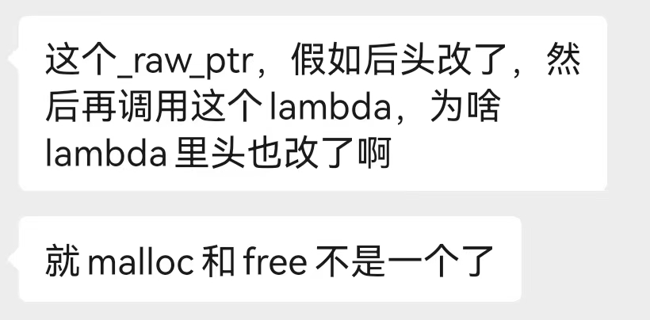

# 02-Basics

### 上半部分

1. 使用gcc（善用compiler explorer）编译并运行下面的程序：

   ```c++
   #include <limits>
   int main()
   {
       int a = std::numeric_limits<int>::max();
       int b = a + 1;
       return 0;
   }
   ```

   随后尝试加上编译选项`-ftrapv`，看看运行结果有没有变化。

2. 打印一个`std::uint8_t`的变量的地址；如果你想用`print`，可以使用`std::println("{}", 你的地址)`。

3. 在2001年的游戏《雷神之锤3》（Quake III Arena）中，使用了一种快速倒数平方根算法，用于对于32位浮点数`x`计算$1/\sqrt x$的近似值。它的算法如下：

   ```pseudocode
   /* 设操作BitEquiv表示两个数在二进制表示上相同, i32表示32位整数，f32表示32位浮点数。*/
   f32 GetInvSqrt(f32 num)
   {
       i32 a <- BitEquiv(num);
       i32 b <- 0x5f3759df - (a >> 1);
       f32 y <- BitEquiv(b);
       return y * (1.5f - (num * 0.5f * y * y));
   }
   ```

   试把上述伪代码转为C++代码。可以尝试几个数，看看和`<cmath>`中的`std::sqrtf`相比的误差；如果你感兴趣，也可以在quick-bench上比一比性能。

   > 当然，这个算法在目前是比CPU硬件指令更慢的，只是在2000年代更好。它本质上使用了牛顿迭代法，`return`的步骤进行了一次迭代，如果想要更高的精度可以把它赋给`y`，继续用该式迭代。

4. 写一个将二进制数据转为HTTP要求的字节序的函数。注意用`std::endian`区分当前机器大小端的情况；如果两个都不是，打印一个警告。

5. 判断以下程序的合法性：

   ```c++
   int a[][3] = { {1, 2, 3}, {4,5,6} };
   int (*b)[3] = a; // 合法吗？
   int **c = a; // 合法吗？
   int **d = b; // 合法吗？
   ```

   ```c++
   int a[]{1,2,3}, b[]{4,5,6,7};
   void Func(int (&a)[3]) { /* ... */}
   void Func2(int a[3]) { /* ... */}
   
   Func(a); Func2(a);
   Func(b); Func2(b); // 这四个里面哪个合法？
   ```

   希望你可以通过这个例子区分指针和数组，加深对数组decay的理解；指针所指向的目标不会继续decay，引用所引用的目标也会暂时保持原类型（不过仍然允许后续的decay，比如上面的`Func`中`int* p = a;`是合法的）。

6. 写一个函数，它接受一个返回值为`int`、参数为`float`和`double`的函数指针为参数，返回`void`。

7. 写一个scoped enumeration，它包含`read, write, exec`三个选项；同时为了使它们可以按位组合，编写一个配套的重载的按位与和按位或的运算符。为了一般性，可以使用`auto b = std::to_underlying()`；如果你的编译器不支持，可以使用`using T = std::underlying_type<Enum>`，再手动转为`T`。

8. 对于下面的程序：

   ```c++
   #include <map> 
   int main()
   { 
       std::map<int, int> m; 
       m[0] = m.size();
   }
   ```

   按照C++17标准规定，`m[0]`是什么？

## 后半部分

1. 写一个`Vector3`类，它还有三个float分量，可以用不超过3个float进行初始化，例如：

   ```c++
   Vector3 vec; // (0, 0, 0)
   Vector3 vec2{1}; // (1, 0, 0)
   Vector3 vec3{1, 2}; //  (1, 2, 0)
   ```

   同时，定义`operator+`和`operator+=`。试一试，`1+a`在`operator+`写成成员函数时是否可用？写成全局函数时呢？给构造函数加上`explicit`时呢？

   > 这是因为`1`作为函数的参数，进行的是copy initialization，这正是explicit所禁止的；必须写为`Vector3{1}`才可以。

   随后，我们增加比较运算符，比较两个向量的长度。用简短的方法使六个比较运算符都有效。

   别忘了用属性警告用户某些运算符的返回值不应被抛弃。

2. 除了`vector`，其他的容器可以使用Uniform initialization吗？特别地，`map`和`unordered_map`每个元素是一个pair。

3. 有虚函数的类和普通的类相比，有大小上的差别吗？

4. 下面的两个函数构成重载吗？

   ```c++
   void Test(int);
   int Test(int);
   ```

   下面两个呢？`T = void`会有干扰吗？

   ```c++
   void Test(int);
   template<typename T> T Test(int);
   ```

   想一想name mangling的规则，得出你的结论，在编译期上进行测试。

5. 下面的程序中，`bar`返回什么是确定的吗？分别在gcc无优化选项和`-O2`中试试。

   ```c++
   struct Foo
   {
       int foo()
       {
           return this ? 42 : 0;
       }
   };
   
   int bar()
   {
       Foo* fptr = nullptr;
       return fptr->foo();
   }
   ```

   这道题的目的是告诉你不要写UB，空指针不能解引用。

6. 写一个三维数组，以存储的类型为模板参数，内部使用摊平的一维连续数组存储，允许使用多维下标运算符进行访问。定义它的拷贝构造函数，想想是否要考虑自赋值问题。

7. 写一个函数，它接受`std::vector<int>&`，使用`<algorithm>`中的`std::ranges::generate`在其中填充斐波那契数列。你只需要填写第二个参数，即一个lambda表达式：

   ```c++
   void FillFibonacci(std::vector<int>& v)
   {
       std::ranges::generate(v, /* 你的回答 */);
   }
   ```

   可以认为上面的式子相当于：

   ```c++
   for(auto& elem : v)
       elem = YourLambda();
   ```

   > 提示：你可以在capture中创建新的变量，例如`[a = 0, b = 1]`。

8. 定义一个scoped enumeration `Color`，有red, blue, green三个枚举量。编写一个`switch`，使得`red`和`green`都打印`Hello`，对`blue`打印`World`。使用`using enum`来避免每个枚举都写`Color::`，并使用属性防止编译器对fallthrough给出警告。

9. 对下面的结构体的数组调用sort，使用lambda表达式进行比较。

   ```c++
   struct DijkstraInfo
   {
       int vertexID;
       int distance; // 作为比较的标准
   };
   
   std::ranges::sort(vec, /* 你的lambda表达式 */ );
   ```

   想一想，是否可以把两个参数类型都写成`const auto&`？

   如果你写成一个函数：

   ```c++
   bool Func(const auto& a, const auto& b);
   ```

   它能否像lambda表达式一样传入`sort`？还是需要实例化？为什么？

   如果你写成一个下面的结构体：

   ```c++
   template<typename T>
   struct Functor
   {
       // 如果你的编译器暂时不支持static operator()，把static去掉.
       static bool operator()(const T& a, const T& b){ /* ... */ }
   };
   ```

   它能否像lambda表达式一样传入`sort`？还是需要实例化？为什么？

   希望你通过这个例子理解模板实例化的要求, 可以通过包装在无需实例化的实体中绕过限制, 推迟到调用的时候再实例化, 此时就不需要程序员手动实例化.

10. 解答Lee的问题; 你应该如果解决?

    

    